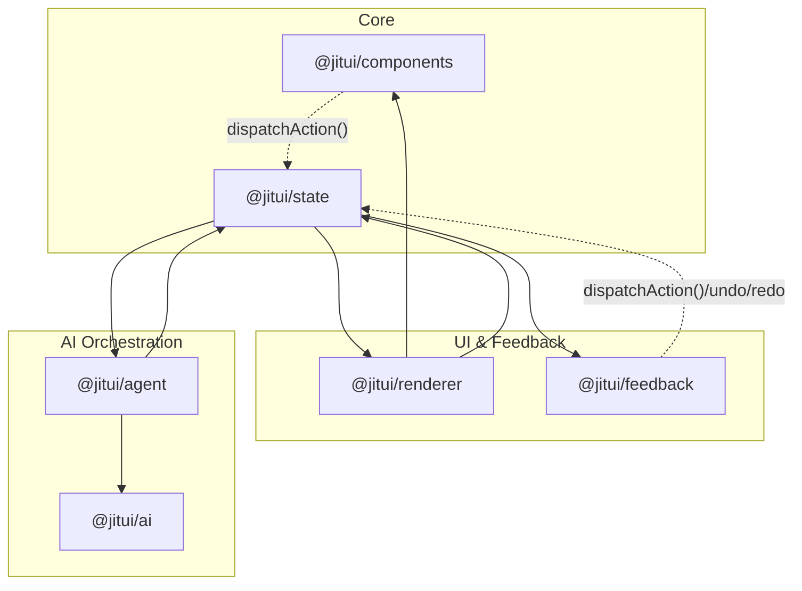
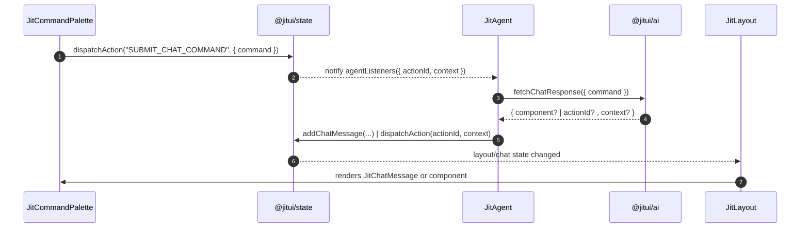
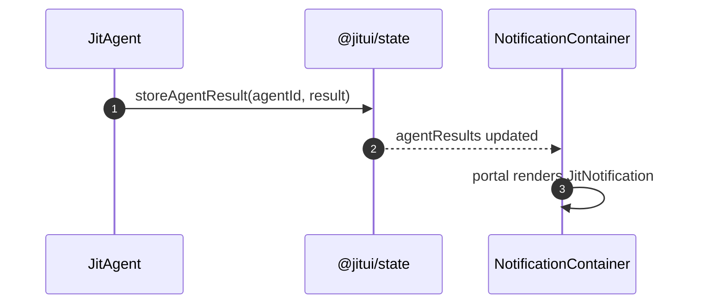

## JITUI Framework Architecture

This document explains the overall architecture of the JITUI Framework and how the packages interact.

### Modules and Dependencies

Key ideas:
- Components are logic-free and use `dispatchAction` to trigger behavior.
- `@jitui/state` is the single source of truth and hosts the Action Registry.
- `@jitui/agent` observes actions via agent listeners and calls `@jitui/ai`.
- `@jitui/renderer` renders state-driven layouts and portal-based notifications.
- `@jitui/feedback` surfaces user controls like command palette, diff view, undo/redo.

### Action Flow: Chat Command to Generative UI

### Notification Flow: Background Agent Result

### Design Principles
- Stateless UI components with explicit props and `aiProps` support.
- Serializable, debuggable state; no functions stored in state.
- Event-driven AI orchestration decoupled from rendering.
- Pluggable sub-agents and external AI services.

